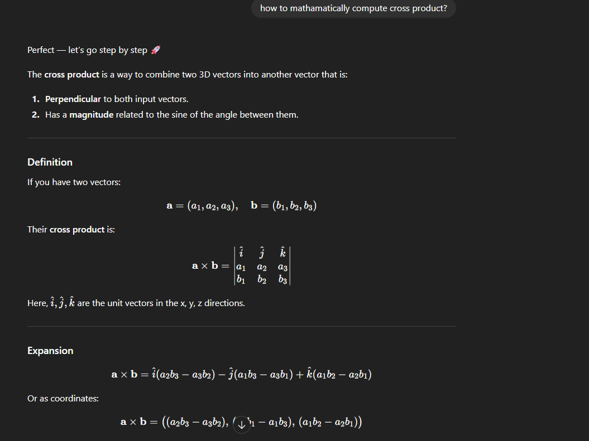

## unit vector

A unit vector is a vector that has a magnitude (length) of 1.

It is mainly used to represent direction without scaling.

Key Points:

A vector has magnitude (length) and direction.

A unit vector keeps the direction but its length is always 1.

Unit vectors are often denoted with a "hat" symbol, like:

𝑖
^
,
𝑗
^
,
𝑘
^
i
^
,
j
^
	​

,
k
^

in 3D space (x, y, z axes).

Formula to find a unit vector

If you have any vector v:

𝑣
=
(
𝑥
,
𝑦
,
𝑧
)
v=(x,y,z)

Magnitude of v:

∣
𝑣
∣
=
𝑥
2
+
𝑦
2
+
𝑧
2
∣v∣=
x
2
+y
2
+z
2
	​

The unit vector in the direction of v is:

𝑣
^
=
𝑣
∣
𝑣
∣
=
(
𝑥
∣
𝑣
∣
,
𝑦
∣
𝑣
∣
,
𝑧
∣
𝑣
∣
)
v
^
=
∣v∣
v
	​

=(
∣v∣
x
	​

,
∣v∣
y
	​

,
∣v∣
z
	​

)
Example:

Vector v = (3, 4).
Magnitude: 
∣
𝑣
∣
=
3
2
+
4
2
=
5
∣v∣=
3
2
+4
2
	​

=5.

Unit vector:

𝑣
^
=
(
3
5
,
4
5
)
v
^
=(
5
3
	​

,
5
4
	​

)

This vector points in the same direction as (3,4) but its length is exactly 1.

👉 Do you want me to also show you how unit vectors are used in physics (like force/direction) or in computer graphics (3D space)?

You said:
can you give an example of not unit vector and how they are different 
ChatGPT said:

Great question 👌

Let’s contrast a non-unit vector with a unit vector.

Example of a non-unit vector

Take

𝑎
=
(
6
,
8
)
a=(6,8)

Magnitude:

∣
𝑎
∣
=
6
2
+
8
2
=
36
+
64
=
100
=
10
∣a∣=
6
2
+8
2
	​

=
36+64
	​

=
100
	​

=10

👉 Since the length is 10 (not 1), this is not a unit vector.

Its corresponding unit vector

To make it a unit vector, divide by its magnitude:

𝑎
^
=
1
∣
𝑎
∣
(
6
,
8
)
=
(
6
10
,
8
10
)
=
(
0.6
,
0.8
)
a
^
=
∣a∣
1
	​

(6,8)=(
10
6
	​

,
10
8
	​

)=(0.6,0.8)

Magnitude check:

∣
𝑎
^
∣
=
0.6
2
+
0.8
2
=
0.36
+
0.64
=
1
=
1
∣
a
^
∣=
0.6
2
+0.8
2
	​

=
0.36+0.64
	​

=
1
	​

=1

✅ This is now a unit vector.

Difference:

Non-unit vector → magnitude ≠ 1 (can be 5, 10, 100, etc.), carries both direction and scale (length).

Unit vector → magnitude = 1, carries only direction (no extra scaling).

Think of it like this:

A non-unit vector is like an arrow that shows direction and how far.

A unit vector is like an arrow that shows only direction, with length fixed to 1.

👉 Want me to also give you a real-world example (like walking 10 meters east vs. just pointing east)?

Vectors for ML
Last Updated : 23 Jul, 2025
Vectors are a basic notion in machine learning and are very significant in data representation as well as data processing. They are applied in most machine learning algorithms that are used in classification, regression, clustering and deep learning. By definition, a vector is a mathematical concept with magnitude and direction. In machine learning, it is employed to encode numerical data so that computers can easily process and analyze the information.

What is a Vector?
A vector is a list of numbers in order, commonly referred to as components or elements. They are different features of points of data expressed in an ordered form. A vector in a two-dimensional plane can be defined as:

ν
ν= (x1, x2)

For example- a vector for someone's height (in cm) and weight (in kg) might be:

ν
ν= (170, 65)

In higher dimensions, vectors will have more components, such as:

ν
ν= (x1, x2, x3, ..........., xn)

where n is the number of features of a specific data point.

Code to Create and Print a Vector in NumPy:

import numpy as np
​
vector = np.array([170, 65])
​
print("Vector:", vector)

Output
Vector: [170  65]
Scalars, Vectors and Matrices
Scalars: Any single value from our dataset would represent a scalar like integers or floating-point numbers, employed in mathematical computation.
Vectors: Vectors are one-dimensional number arrays that hold several values in a linear sequence.
Matrices: Matrices are two-dimensional arrays of multiple vectors that are placed in rows and columns.
These mathematical structures play an essential role in machine learning models, facilitating effective calculations and data representation.

mat = np.array([[1, 2, 3], 
                   [4, 5, 6], 
                   [7, 8, 9]])

print(mat)
import numpy as np
​
# Define a 3x3 matrix
mat = np.array([[1, 2, 3], 
                   [4, 5, 6], 
                   [7, 8, 9]])
​
print(mat)

Output
Matrix:
[[1 2 3]
 [4 5 6]
 [7 8 9]]
Vectors in Machine Learning Models
Vectors are used at various points in machine learning models:

1. Input: Machines only process data numerically. The inputs like images, text or sensor inputs must be converted into numbers and represented as vectors. Models are able to efficiently analyze data by this organized representation. Feature engineering methods assist in converting raw data into useful vector representations for training models.

2. Model: The heart of machine learning is creating models that take in input data and learn to make predictions. In deep learning models, this is done through a neural network wherein the layers of the neural network employ linear algebra (such as matrix and vector multiplication) in order to update your parameters. Vectors can be used for operations like scaling, rotation and reducing dimensions, which allows computations to be efficient and increase model accuracy.

3. Outputs: The results of machine learning models can take various forms, such as numbers, images or even vectors. f we’re classifying images, the output will be a category of image. For instance, in natural language processing (NLP), a vector may represent the final output of a model and serve as input for another task, such as classification or recommendation systems. Vector operations such as similarity calculations, clustering and projections are used to interpret and refine model outputs.

Types of Vectors in Machine Learning
1. Row and Column Vectors
A row vector is a one-dimensional array represented in a row format: (x1, x2, x3)
A column vector is a one-dimensional array represented in a column notation:
[
x
1
x
2
x
3
⋮
x
n
]
⎣
⎡
​
  
x 
1
​
 
x 
2
​
 
x 
3
​
 
⋮
x 
n
​
 
​
  
⎦
⎤
​
 

2. Zero Vector
A vector with all elements as zero. Example:

ν
ν= (0, 0, 0)

Zero vectors are useful when solving optimization problems and are the origin in vector space.

3. Unit Vector
A vector of magnitude 1. It is frequently used to denote direction:

u
=
v
∥
v
∥
u= 
∥v∥
v
​
 

where 
∥
ν
∥
∥ν∥ is the magnitude of vector v.

4. Sparse and Dense Vectors
Sparse Vectors consist primarily of zeros and are employed in text analysis and recommendation systems.
Dense Vectors consist primarily of non-zero values and are employed in image processing and deep learning.
Importance of Vectors in Machine Learning
1. Feature Representation
Vectors are used to represent data points in numerical form. For example, in natural language processing (NLP), words are translated into word vectors by techniques such as Word2Vec or TF-IDF.

2. Distance and Similarity Measures
Similarity between data points is typically calculated in machine learning by vector distance measures like:

Euclidean Distance: Quantitative measure of straight-line distance between two points.
Cosine Similarity: Quantifies the cosine of the angle between two vectors to ascertain similarity.
3. Transformations and Projections
Vectors enable mathematical transformations such as rotation, scaling and translation. These are employed in methods such as Principal Component Analysis (PCA) to project datasets into lower dimensions.

Application of Vectors in Machine Learning
Vectors play a crucial role in various machine learning algorithms and natural language processing (NLP) techniques.

Linear Regression- Linear regression employs vectors to denote the independent and dependent variable relationship: Y = Xw + b where X is a feature vector, w is a weights vector and b is the bias term.
Support Vector Machines (SVMs)- SVMs utilize vector mathematics to identify the best hyperplane separating various classes in classification problems.
Neural Networks- Neural networks store weights, activations and gradients as vectors, making them crucial for deep learning models.
Clustering (K-Means Algorithm)- The K-Means algorithm allocates points to clusters based on vector distances.
Word Embeddings in NLP- Methods such as Word2Vec and GloVe map words to vectors, capturing their semantic meaning.
Sentence and Document Embeddings- Sentences and documents can also be encoded as vectors using techniques like BERT and Doc2Vec